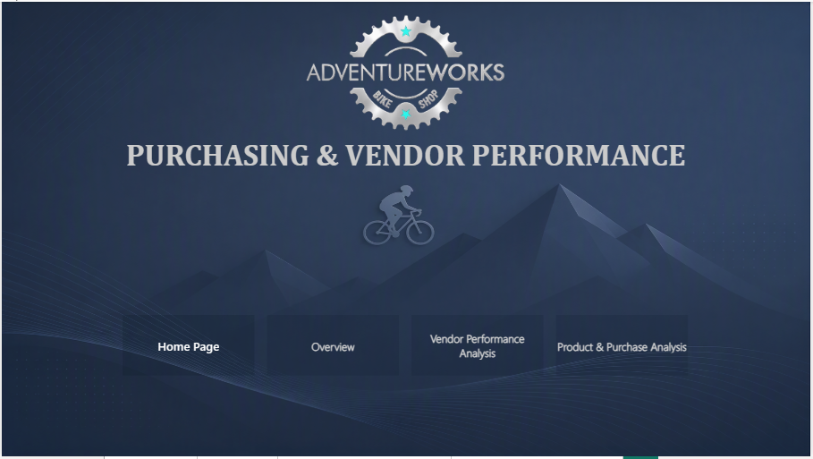
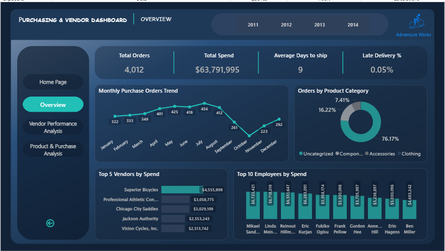
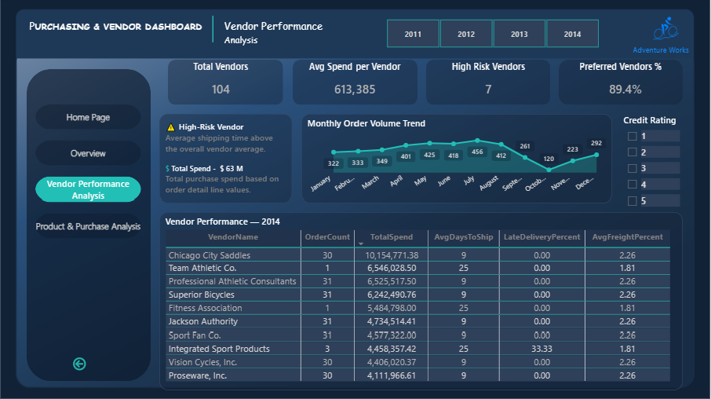
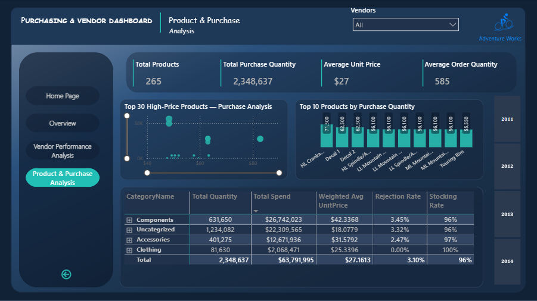

# AdventureWorks Purchasing & Vendor Performance | Power BI + SQL

An end-to-end Business Intelligence project analyzing purchasing 
and vendor performance using the AdventureWorks 2019 database.

---

## Dashboard Preview

---

## Selected Process
Purchasing process from AdventureWorks 2019 database

## Why This Process?
After exploring the database, Purchasing was selected due to rich data 
(delays, costs, vendor performance) and improvable bottlenecks.

## Project Phases
- **Phase 1**: BPMN As-Is + 6 analytical questions
- **Phase 2**: T-SQL (View, SP, RFM, Star Schema)
- **Phase 3**: Power BI Dashboard
- **Phase 4**: BPMN To-Be + Expected Impact
- **Phase 5**: Storytelling
- **Phase 6**: Publication

## Key Findings
| Insight | Value |
|---|---|
| Low-frequency vendors | 86 vendors (25 days) |
| High-frequency vendors | 79 vendors (9 days) |
| Bipolar distribution | Confirmed |
| Vendors to remove (RFM) | 4 |
| Vendors to increase frequency | 3 |
| Worst delay | 187 days |

## To-Be Recommendation
Adding "Low-frequency?" Gateway + two paths:
- Merge At Risk vendors
- Consolidate orders to increase frequency

## Project Structure
- `/bpm` — BPMN As-Is and To-Be
- `/sql` — Queries, Views, SP, RFM
- `/powerbi` — Power BI Dashboard
- `/docs` — Documentation and Presentations

## How to Run
1. Run `sql/*.sql` files in SQL Server
2. Open `powerbi/AW-VendorsPerformance.pbix` in Power BI
3. View BPMN models in `/bpm`
4. View presentations in `/docs`

## Tools & Technologies
- **Power BI** — Dashboard, Data Modeling, DAX
- **SQL Server (T-SQL)** — Views, Stored Procedures, RFM
- **BPMN** — As-Is / To-Be process modeling
- **Git / GitHub** — Version control

## My Contribution (Narges Heidari)
- Designed and built the complete 4-page Power BI dashboard
- Created all DAX measures and KPIs
- Optimized dashboard performance
- Designed the UX/UI and visual storytelling

## Team Contribution
| Name | Role | Contributions |
|---|---|---|
| Narges Heidari | Power BI & Dashboard | 4-page Dashboard, DAX Measures, Screenshots, Performance Optimization |
| Sara ValiPoor | BPM, SQL & Process Improvement | BPMN As-Is/To-Be, Analytical Queries, Views, SP, RFM, Storytelling |

## Connect With Me
- **LinkedIn**: https://www.linkedin.com/in/nargess-heidari
- **Email**: H.narsis85@gmail.com

I'm open to **freelance Power BI & Data Analytics projects**.

